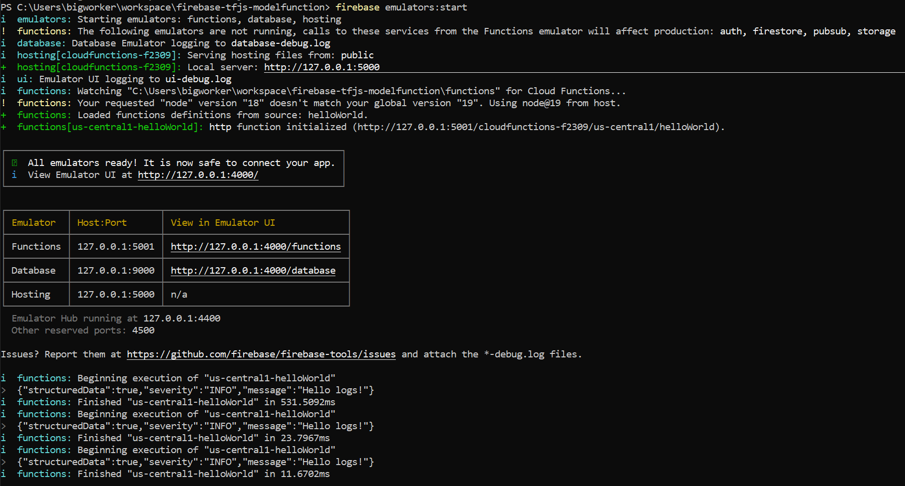
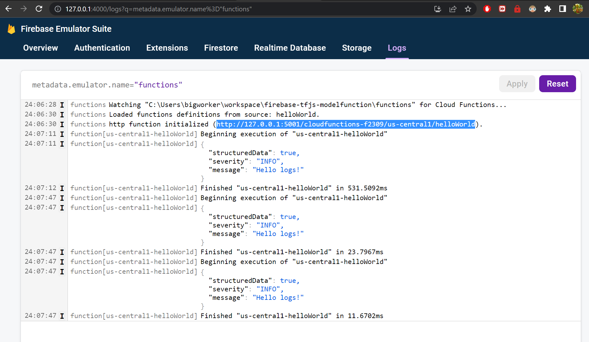
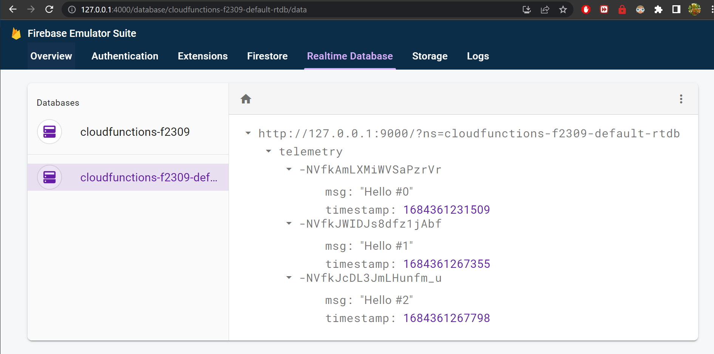
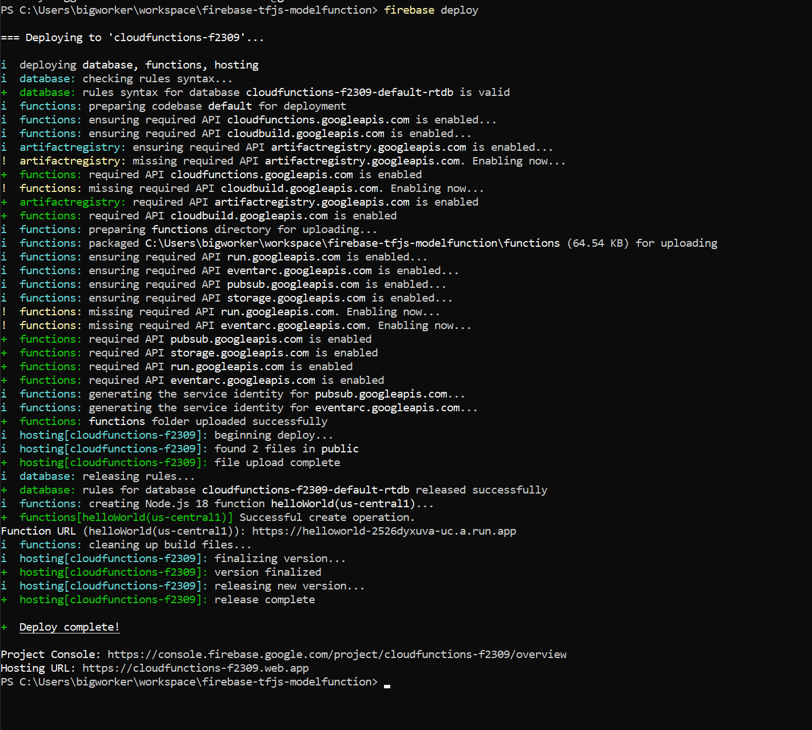
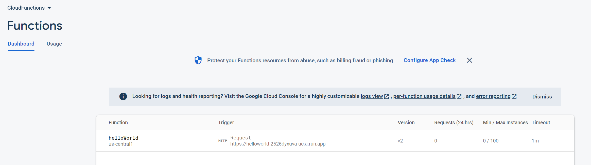
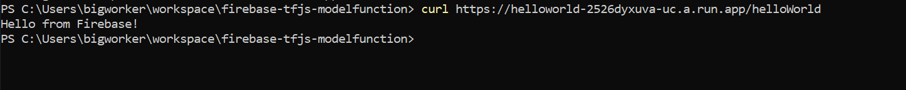
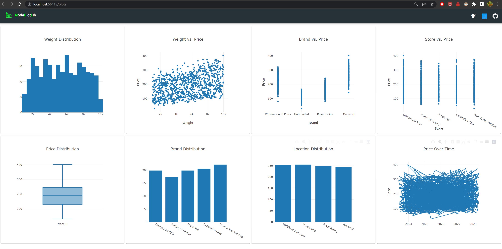
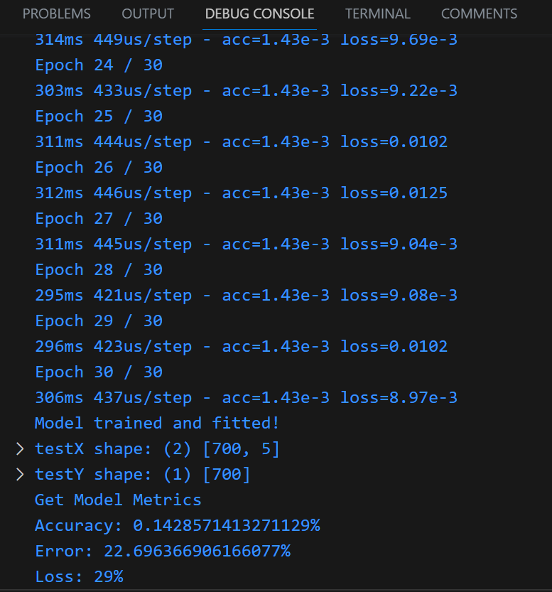

# Firebase CloudFunctions and TensorflowJS - Serve your Model on Budget

In this article we will utilize Firebase Cloud Functions project to host a TensorFlow.js model and open it up to predictions through API calls. 
We'll save call telemetry to the Firebase Realtime Database, to give us history we can analyze later on.

# Start with Firebase

Register your free firebase account here: https://console.firebase.google.com/. 
You will have to create a project, keep it's name in mind.

Then on your machine, install firebase globally:

`npm install -g firebase-tools`

Login to the account your have created:

`firebase login`

And initialize your project by selecting the existing project you created, cloud firebase capabilities, cloud realtime database serivce and the emulator. Use the follow command:

`firebase init`

You'll follow the prompts and enable the services mentioned above. At the end of the whole process, you will have a *firebase.json* file that is similar to this:

```json
{
  "database": {
    "rules": "database.rules.json"
  },
  "functions": [
    {
      "source": "functions",
      "codebase": "default",
      "ignore": [
        "node_modules",
        ".git",
        "firebase-debug.log",
        "firebase-debug.*.log"
      ]
    }
  ],
  "emulators": {
    "functions": {
      "port": 5001
    },
    "database": {
      "port": 9000
    },
    "ui": {
      "enabled": true
    },
    "singleProjectMode": true
  }
}
```

# Create the NodeJs cloud Function

The firebase cli tool should have created a **functions** folder, navigate to the folder.

Edit *index.js* with these details to create the entry script:

```javascript
const { onRequest } = require("firebase-functions/v2/https");
const logger = require("firebase-functions/logger");
const admin = require('firebase-admin');

admin.initializeApp();
const database = admin.database();

let GLOBAL_COUNT = 0;

exports.helloWorld = onRequest(async (request, response) => {
    logger.info("Hello logs!", { structuredData: true });

    // Save telemetry to Firebase Realtime Database
    await database.ref('telemetry').push({
        msg: `Hello #${GLOBAL_COUNT++}`,
        timestamp: Date.now(),
    });

    response.send("Hello from Firebase!");
});

```

install all the imported libraries:

`npm install express firebase-admin`

# Emulator to Test the Function

In our project setup, we asked for an emulator to validate our code before going to the cloud. Let's run it:

`firebase emulators:start`

it will print the Emulator's UI url which you can use to browse to:



Go to the function, and access the given url. You should see the 'hello world' ouput, and the logs should start showing on the UI:



Now let's access the DB's emulator UI and check what telemetery we go:



With the emulator validating our setup, let's deploy to the actual Firebase service

# Hello Firebase

To deploy our code, we type the following in the Cli:

`firebase deploy`

Don't worry if you are asked to switch the payment plan to blaze (mostly because of the cloud functions) and enter your credit card details.
If the deploy is successful, you should see this in your cli:




The cloud function should be visible from firebase:



If you curl or use Postman to hit that url show on firebase, you will get hello world:



# Show us the Models!

Time to step it up with some datascience. 

It's recommended to create a folder where we will process the data and test the model, before embedding it into the cloud function. CD to the folder, and run `npm init` to initialize a simple package setup. 

From here install all required TensorFlowJS dependencies:

`npm install @tensorflow/tfjs @tensorflow/tfjs-node nodeplotlib`

For this experiment, we don't have any dataset - so let's synthesize one. We want data that describes catfood, and we will use this to find the best price of a purchase.

We need to generate some synthetic data and the code below will help us with that:

```javascript
/**
 * Tensorflow JS Analysis and Model Building.
 */

import * as tf from '@tensorflow/tfjs-node'
import { plot } from 'nodeplotlib';
import Plot from 'nodeplotlib';
const { tidy, tensor2d } = tf;

// Constants
const BRANDS = ['Whiskers', 'Royal Feline', 'Meowarf', 'Unbranded'];
const STORES = ['Fresh Pet', 'Expensive Cats', 'Overpriced Pets', 'Jungle of Money', 'Mom & Pop Petshop'];
const MAX_DS_X = 1000;
const EPOCHS = 30;

/**
 * Generates random cat food data, either as normal or uniform data.
 * 
 * @param numRows The size of the dataset in X
 * @returns 2darray of features.
 */
function generateData(numRows,
    wieghtRangeGrams = { min: 1000.0, max: 10000.0 },
    brands = BRANDS,
    stores = STORES) {

    const brandIndices = tf.randomUniform([numRows], 0, brands.length, 'int32');
    const brandLabels = brandIndices.arraySync().map(index => brands[index]);
    const locationIndices = tf.randomUniform([numRows], 0, stores.length, 'int32');
    const locationLabels = locationIndices.arraySync().map(index => stores[index]);

    const bestBeforeDates = tf.randomUniform([numRows], 0, 365 * 5, 'int32');
    const baseDate = new Date();
    const bestBeforeDatesFormatted = bestBeforeDates.arraySync().map(days => {
        const date = new Date(baseDate);
        date.setDate(baseDate.getDate() + days);
        return date.toISOString().split('T')[0];
    });

    // Generate price values based on weights (with minor variance)
    const weights = tf.randomUniform([numRows], wieghtRangeGrams.min, wieghtRangeGrams.max, 'float32');

    const pricesTemp = weights.div(120);
    const priceMean = tf.mean(pricesTemp).arraySync(); // Mean weight
    const priceStd = tf.moments(pricesTemp).variance.sqrt().arraySync();
    const priceNoise = tf.randomNormal([numRows], priceMean, priceStd, 'float32');
    let prices = tf.tensor1d(pricesTemp.add(priceMean).add(priceNoise).arraySync());

    // Apply logic and transform each number
    prices = tf.tensor1d(prices.dataSync().map((value, index) => {
        const brandLabel = brandLabels[index];
        let newPrice = value;
        switch (brandLabel) {
            case 'Unbranded':
                newPrice *= 0.82;
                break;

            case 'Royal Feline':
                newPrice *= 1.12;
                newPrice += 10;
                break;

            case 'Whiskers and Paws':
                newPrice *= 1.45;
                newPrice += 25;
                break;

            case 'Meowarf':
                newPrice *= 1.60;
                newPrice += 50;
                break;

            default:
                throw new Error(brandLabel);
        }
        return newPrice;
    }));


    const data = {
        weight: weights.arraySync(),
        brand: brandLabels,
        storeLocation: locationLabels,
        bestBeforeDate: bestBeforeDatesFormatted,
        priceUSD: prices.arraySync(),
    };

    return data;
};
...

console.log('Generating Synth Data');
        const catFoodDataset = await generateData(MAX_DS_X);
```

Using tensorflow normal and uniform based distribution function, we creat random data. We would like some element of correlation between features, so we try to pin price with weight.

Once the data is created, we can do some basic javascript powered EDA:

```javascript
/**
 * Does some EDA on the given data.
 * 
 * @param {*} {
 *       weight: aray of floats,
 *       brand: array of label strings,
 *       storeLocation: array of label strings,
 *       bestBeforeDate: array of iso dates,
 *       priceUSD: aray of floats,
 *   }; 
 */
function dataEDA(data) {
    function _countUniqueLabels(labels) {
        return labels.reduce((counts, label) => {
            counts[label] = (counts[label] || 0) + 1;
            return counts;
        }, {});
    }

    const { weight, brand, storeLocation, bestBeforeDate, priceUSD } = data;

    // Summary statistics
    const weightMean = tf.mean(weight);
    const weightStd = tf.moments(weight).variance.sqrt().arraySync();
    const priceMean = tf.mean(priceUSD);
    const priceStd = tf.moments(priceUSD).variance.sqrt().arraySync();

    console.log('Weight Summary:');
    console.log(`Mean: ${weightMean.dataSync()[0].toFixed(2)}`);
    console.log(`Standard Deviation: ${weightStd}`);
    console.log('\nPrice Summary:');
    console.log(`Mean: ${priceMean.dataSync()[0].toFixed(2)}`);
    console.log(`Standard Deviation: ${priceStd}`);

    // Histogram of weights
    const weightData = [{ x: weight, type: 'histogram' }];
    const weightLayout = { title: 'Weight Distribution' };
    plot(weightData, weightLayout);

    // Scatter plot of weight vs. price
    const scatterData = [
        { x: weight, y: priceUSD, mode: 'markers', type: 'scatter' },
    ];
    const scatterLayout = { title: 'Weight vs. Price', xaxis: { title: 'Weight' }, yaxis: { title: 'Price' } };
    plot(scatterData, scatterLayout);

    // Box plot of price
    const priceData = [{ y: priceUSD, type: 'box' }];
    const priceLayout = { title: 'Price Distribution' };
    plot(priceData, priceLayout);

    // Bar chart of a categorical feature
    const brandCounts = _countUniqueLabels(brand);
    const locCounts = _countUniqueLabels(storeLocation);

    const brandLabels = Object.keys(brandCounts);
    const locLabels = Object.keys(locCounts);

    const brandData = brandLabels.map(label => brandCounts[label]);
    const locData = locLabels.map(label => locCounts[label]);

    const brandBar = [{ x: brandLabels, y: brandData, type: 'bar' }];
    const locBar = [{ x: locLabels, y: locData, type: 'bar' }];

    const brandLayout = { title: 'Brand Distribution' };
    const locLayout = { title: 'Location Distribution' };

    plot(locBar, brandLayout);
    plot(brandBar, locLayout);

    // Line chart of price over time (Best before date)
    const priceOverTime = bestBeforeDate.map((date, index) => ({ x: date, y: priceUSD[index] }));
    priceOverTime.sort((a, b) => a.x - b.x); // Sort by date in ascending order
    const lineData = [{ x: priceOverTime.map(entry => entry.x), y: priceOverTime.map(entry => entry.y), type: 'scatter' }];
    const lineLayout = { title: 'Price Over Time', xaxis: { type: 'date' }, yaxis: { title: 'Price' } };
    plot(lineData, lineLayout);
}
...
 await dataEDA(catFoodDataset); // For EDA only.
```
This library **nodeplotlib** has been created to spin up a server and visualize the data as if we were on a notebook. Results below:



From the graphs above, the best-before-date and store location provide no value and should be dropped from the features. We are happy to see that even with the data we created, price, brand and wieght have some correlation.

With this data analyzed, and knowing which features to use, we create a function to do this and also give us the training splits:

```javascript

/**
 * Cleans, nromalizes and drops irrelavant data. Then splits the data into train, validate, test sets.
 * 
 * @param {*} data 
 * @param {*} trainRatio 
 * @param {*} testRatio 
 * @param {*} valRatio 
 * @returns {Object} of: {
 *      trainData: {Tensor},
 *      testData: {Tensor},
 *      validationData: {Tensor}
 *   }
 */
function cleanTrainSpitData(data, trainRatio = 0.7, testRatio = 0.1, valRatio = 0.2) {

    /**
     * local function to noramlize a range, will save the mins and maxs to a global cache to be used in a prediction.
     * 
     * @see MINIMUMS
     * @returns {Array[*]} The normalized range.
     */
    function _normalizeFeature(feature, featureName, metaData = DATASETS_METADATA) {
        const min = tf.min(feature);
        const max = tf.max(feature);
        const normalizedFeature = tf.div(tf.sub(feature, min), tf.sub(max, min));

        // We will need to normalize input data with the same constants.
        metaData[featureName] = { min: min, max: max };

        return normalizedFeature;
    }

    // Remove irrelevant features (date in this case) and NaNs
    const cleanedAndNormalizedData = { weight: [], brandOHE: [], storeOHE: [], priceUSD: [] };

    for (let i = 0; i < data.weight.length; i++) {
        // Handle missing values if needed
        if (!isNaN(data.weight[i]) && !isNaN(data.priceUSD[i]) && (data.brand[i])) {
            cleanedAndNormalizedData.weight.push(data.weight[i]);
            cleanedAndNormalizedData.brandOHE.push(data.brand[i]);
            cleanedAndNormalizedData.priceUSD.push(data.priceUSD[i]);
        }
    }

    // Normalize the Data
    cleanedAndNormalizedData.weight = _normalizeFeature(cleanedAndNormalizedData.weight, 'weight');
    cleanedAndNormalizedData.brandOHE = oneHotEncode(cleanedAndNormalizedData.brandOHE);
    cleanedAndNormalizedData.priceUSD = _normalizeFeature(cleanedAndNormalizedData.priceUSD, 'priceUSD');

    const { weight, brandOHE, storeOHE, priceUSD } = cleanedAndNormalizedData;
    const totalSize = weight.shape[0];
    const trainIndex = Math.floor(trainRatio * totalSize);
    const valSize = Math.floor(valRatio * totalSize);
    const testIndex = trainIndex + valSize;

    const trainData = {
        weight: weight.slice([0], [trainIndex]),
        brandOHE: brandOHE.slice([0], [trainIndex]),
        priceUSD: priceUSD.slice([0], [trainIndex])
    };
    const validationData = {
        weight: weight.slice([trainIndex], [valSize]),
        brandOHE: brandOHE.slice([trainIndex], [valSize]),
        priceUSD: priceUSD.slice([trainIndex], [valSize])
    };
    const testData = {
        weight: weight.slice([testIndex]),
        brandOHE: brandOHE.slice([testIndex]),
        priceUSD: priceUSD.slice([testIndex])
    };

    return {
        trainData: trainData,
        testData: testData,
        validationData: validationData
    };
}
...
console.log('Clean and Split Data');
const datasets = await cleanTrainSpitData(catFoodDataset);
```

Finally we build the model:

```javascript

/**
 * 
 * @param {*} trainData 
 * @param {*} validationData 
 * @param {*} testData 
 * @param {*} numEpochs 
 */
async function buildLinearRegressionModel(trainData, validationData, testData, epochs) {
    const { weight, brandOHE, storeOHE, priceUSD } = trainData;
    const trainX = tf.tensor2d(
        tf.concat([
            tf.tensor2d(weight.arraySync(), [weight.arraySync().length, 1]),
            tf.tensor2d(brandOHE.arraySync())], 1)
            .arraySync());
    const trainY = tf.tensor1d(priceUSD.arraySync());

    console.log('trainX shape:', trainX.shape);
    console.log('trainY shape:', trainY.shape);

    const model = tf.sequential();
    model.add(tf.layers.dense({
        units: trainX.shape[0],
        activation: 'sigmoid',
        inputShape: [trainX.shape[1]]
    }));
    model.add(tf.layers.dense({ units: trainX.shape[0] / 2, activation: 'sigmoid' }));
    model.add(tf.layers.dense({ units: 1, activation: 'linear' }));
    model.compile({
        optimizer: 'adam',
        loss: 'meanSquaredError',
        metrics: ['accuracy']
    });

    const history = await model.fit(trainX, trainY, { validationData: validationData, epochs: epochs });

    console.log("Model trained and fitted!")

    const { weight: testWeight, brandOHE: testBrandOHE, storeOHE: testStoreOHE, priceUSD: testPriceUSD } = testData;

    const testX = tf.tensor2d(
        tf.concat([
            tf.tensor2d(testWeight.arraySync(), [testWeight.arraySync().length, 1]),
            tf.tensor2d(testBrandOHE.arraySync())], 1)
            .arraySync());
    const testY = tf.tensor1d(testPriceUSD.arraySync());

    console.log('testX shape:', testX.shape);
    console.log('testY shape:', testY.shape);

    const testPredictions = await model.predict(testX);

    return {
        model: model,
        predictions: testPredictions,
        trueValues: testY,
        history: history.history
    };
}
...
console.log('Build Model');
const modelMetaData = await buildLinearRegressionModel(datasets.trainData, datasets.validationData, datasets.trainData, EPOCHS);
```

And do an evaluation of the model:

```javascript
/**
 * 
 * @param {*} model 
 * @param {*} testData 
 */
async function modelMetrics(modelMetaData) {
    const accuracy = tf.metrics.binaryAccuracy(modelMetaData.trueValues, modelMetaData.predictions);
    const error = tf.metrics.meanAbsoluteError(modelMetaData.trueValues, modelMetaData.predictions);

    console.log(`Accuracy: ${accuracy.arraySync()[accuracy.arraySync().length - 1] * 100}%`);
    console.log(`Error: ${error.arraySync()[error.arraySync().length - 1] * 100}%`);

    console.log(`Loss: ${[modelMetaData.history.loss.length - 1]}%`);
}
...
console.log('Get Model Metrics');
await modelMetrics(modelMetaData, datasets.trainData);
```

Which give us these results:



Yikes! What terrible results. Nonetheless, we trained this model on unrealistic data. Garbage-in-garbage-out so they say. Let's continue with firebase.